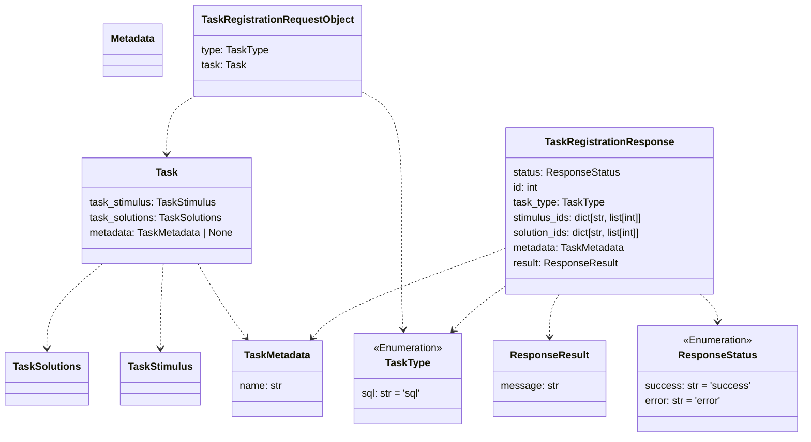

```mermaid
classDiagram

    class TaskSolutions {
    }

    class Task {
        task_stimulus: TaskStimulus
        task_solutions: TaskSolutions
        metadata: TaskMetadata | None
    }

    class TaskStimulus {
    }

    class TaskRegistrationResponse {
        status: ResponseStatus
        id: int
        task_type: TaskType
        stimulus_ids: dict[str, list[int]]
        solution_ids: dict[str, list[int]]
        metadata: TaskMetadata
        result: ResponseResult
    }

    class TaskMetadata {
        name: str
    }

    class Metadata {
    }

    class TaskRegistrationRequestObject {
        type: TaskType
        task: Task
    }

    class ResponseResult {
        message: str
    }

    class TaskType {
        <<Enumeration>>
        sql: str = 'sql'
    }

    class ResponseStatus {
        <<Enumeration>>
        success: str = 'success'
        error: str = 'error'
    }

    Task ..> TaskSolutions
    Task ..> TaskStimulus
    Task ..> TaskMetadata
    TaskRegistrationRequestObject ..> Task
    TaskRegistrationRequestObject ..> TaskType
    TaskRegistrationResponse ..> TaskMetadata
    TaskRegistrationResponse ..> ResponseResult
    TaskRegistrationResponse ..> TaskType
    TaskRegistrationResponse ..> ResponseStatus


```