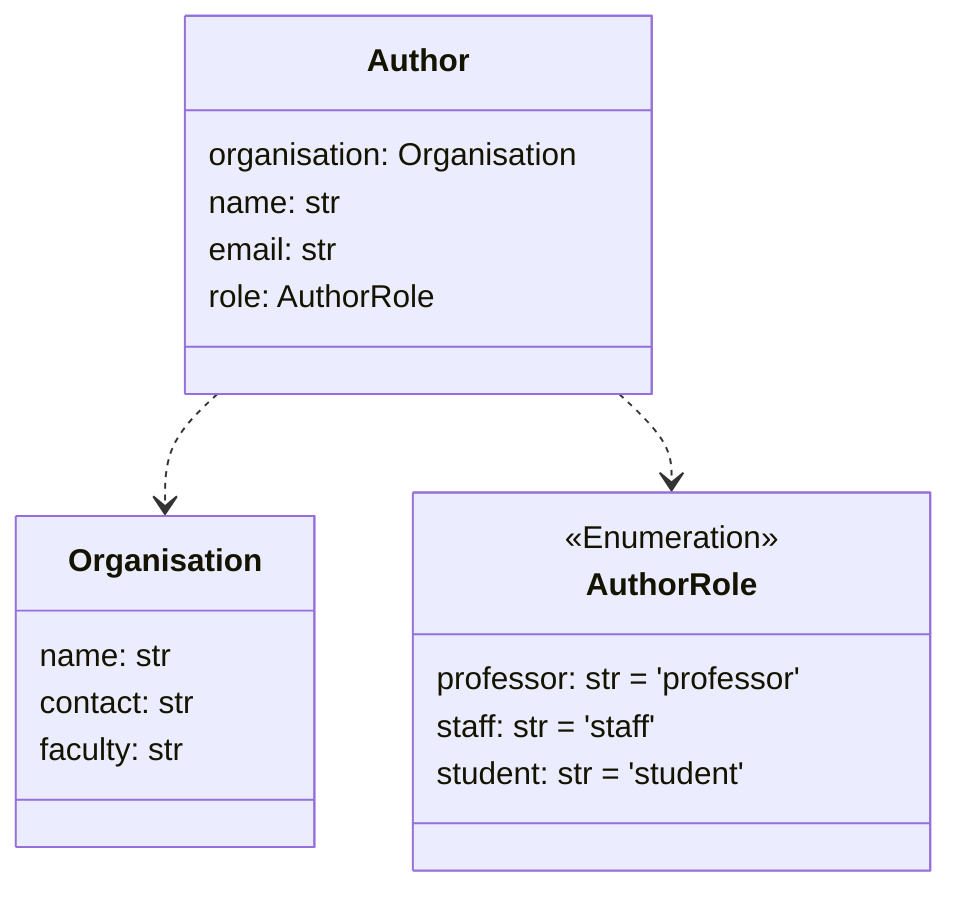

```mermaid
classDiagram

    class Organisation {
        name: str
        contact: str
        faculty: str
    }

    class Author {
        organisation: Organisation
        name: str
        email: str
        role: AuthorRole
    }

    class AuthorRole {
        <<Enumeration>>
        professor: str = 'professor'
        staff: str = 'staff'
        student: str = 'student'
    }

    Author ..> Organisation
    Author ..> AuthorRole
```